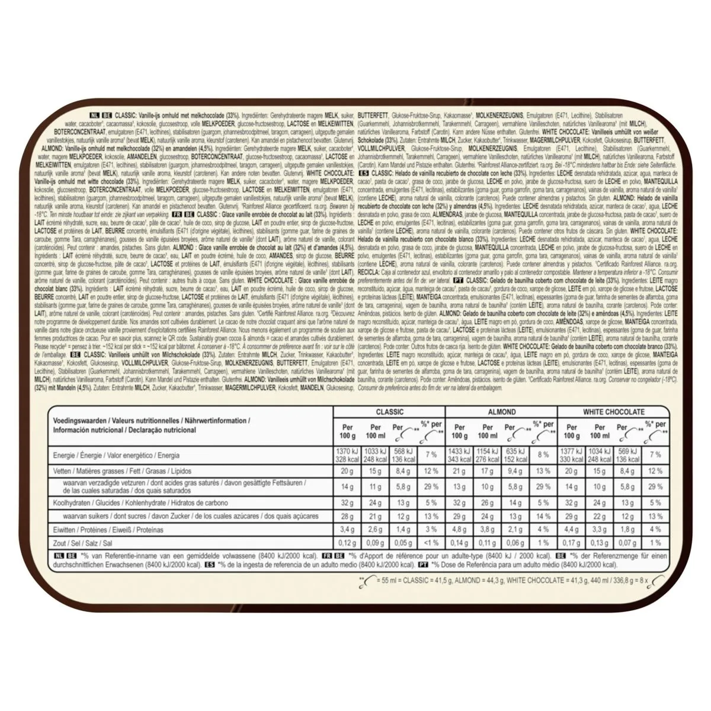

# Magnum Popsicle Calculator

## The Problem

Magnum popsicles are sold in packages of eight with the flavors Classic, Almond, and White. The weights of the individual popsicles and the weight of the packaging are given, but not the quantities of each flavor.

So how many are Classic, Almond or White?

The weight of each flavor, as well and the total packaging weight are mentioned in the bottom right corner.

## The Solution

Two solutions are shown.

- a classic brute force approach, with a slight optimization.
- using [Z3 Theorem Prover](https://en.wikipedia.org/wiki/Z3_Theorem_Prover), [Z3Prover/z3](https://github.com/Z3Prover/z3) in Python.

## Open Questions

- how can we get all solutions in z3? 